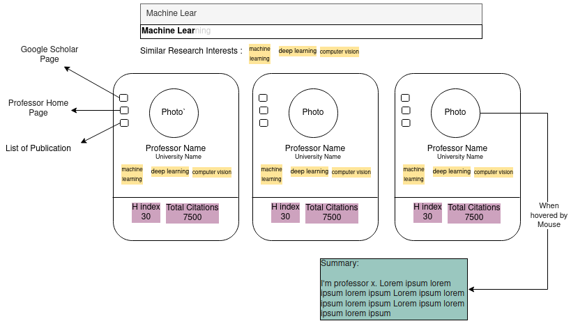
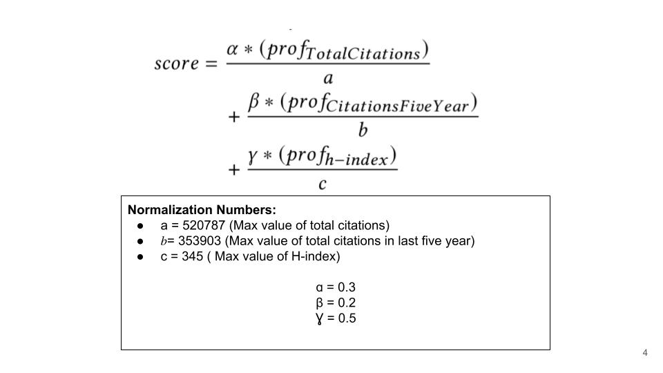
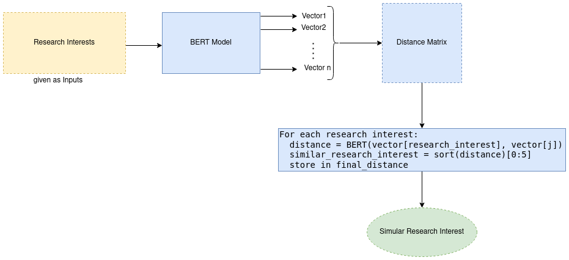
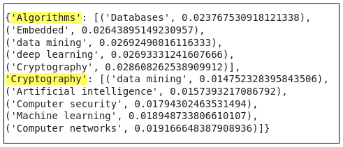

# ProfSearch : A Search Engine to find CS Professors <!-- omit in toc -->


     


ProfSearch is a search engine used to search for information aboutthe relevant professor’s research area, basic summary and alsothe rank of professor on the basis of proficiency in their field. Toovercome the above problem we have designed our project thatsearches professors when the user enters the research area andprofessor name. Our project can be helpful to the researchers andthe students who need information about the professors. Usingour App they can search the professor and get a summary of theprofessor.


## Contents :books: <!-- omit in toc -->


### Instructions to run the code 👨‍🏫

1. Clone the repository.
2. Install the dependencies for react
   ```bash
    npm install
   ```
3. The client or the frontent can be now run using the command
   ```bash
    npm start
   ```
4. Go to the flask directory. And create a virtual environment.
   ```bash
    python -m venv env
   ```
5. Activate the virtual environment
    ```bash
    source env/bin/activate
    ```
6. Install the flask dependencies
   ```bash
    pip install -r requirements.txt
   ```
7. You need to have mongodb installed on the server. If not please install it. Run mongodb server
   ```bash
    sudo service mongod start 
   ```
8. Run server
   ```bash
    flask run
   ```

#### Run the server and client 🏃

   ```bash
      npm start
      cd flask
      source env/bin/activate
      flask run
   ```

### Demonstration 🚿


### Features ✅

✅ Search by Research Insterest
✅ Search by Professor Name
✅ Search By University Name
✅ Ranking based on H-index, total citation and Citation with last five years
✅ Home Page Summarization of Each Professor
✅ Similar Research Instersts

### Database Schema 🥁
MongoDB database is used. Below given is the schema of the collections used.
.png)

### Data Collection using Scholarly Library :man_teacher:

Google Scholar ids for all the CS Professors are obtained from the CSRanking.org website's github respository. By using python based scholarly library, we were able to scrape the required data from their respective google scholar page.

```python
import pandas as pd
import numpy as np
import json
from scholarly import scholarly


df = pd.read_csv('final.csv')
pub_df = df.drop(['Unnamed: 0'], axis=1)
data = {}
nul_data=[]
f = open('meta_data.json','w')

for i in range(len(pub_df)):
    try:
        search_query = scholarly.search_author(pub_df['name'][i])
        author = scholarly.fill(next(search_query))
        publications = [[[v for k,v in pub['bib'].items()],pub['num_citations']] for pub in author['publications']]
        data[pub_df['scholarid'][i]] = {'publications': [],
                    'cites_per_year': author['cites_per_year'],
                    'citedby': author['citedby'],
                    'citedby5y': author['citedby5y'],
                    'hindex': author['hindex'],
                    'hindex5y': author['hindex5y'],
                    'i10index': author['i10index'],
                    'i10index5y': author['i10index5y']}
        
    except:
        nul_data.append(i)
        continue

    if (i%50)==0:
      print(i)
    if (i%500)==0:
      with open('meta_data.json', 'a+') as outfile:
        json.dump(data, outfile)
        outfile.write(",")
        data={}
```

An example of collected data is shown below


### Database Querying for Different Search Methods 🔎
The figure given below gives an overview of various search methods used in the web application.

.png)


### Sample Result Page 🙂 
An example of the result page is shown below. Different features are marked for easy understanding.



### Ranking Methodology 🏁
A score is created for each Professor using the formula given below. Higher the score, more relevant or greater the Professor has.



### Website Summarization 📖

Pysummarizer library is used for website summarization. Once the summary is generated for each professor. It is stored in the database where key would be the google scholar id of the professor and value, the summary. An example of the summary generated is shown below.

```python
   def Main(url):
     # Object of web scraping.    
     web_scrape = WebScraping()# Web-scraping.    
     
     document = web_scrape.scrape(url)# Object of automatic summarization.    
     
     auto_abstractor = AutoAbstractor()# Set tokenizer.    
     
     auto_abstractor.tokenizable_doc = SimpleTokenizer()
     
     # Set delimiter.    
     auto_abstractor.delimiter_list = [".", "\n"]
     
     # Object of abstracting and filtering document.    
     abstractable_doc = TopNRankAbstractor()# Summarize document.    
     
     result_dict = auto_abstractor.summarize(document, abstractable_doc)
     
     # Output 5 summarized sentences.    
     
     limit = 5    
     i = 1    
     summary = ""
     
     for sentence in result_dict["summarize_result"]:        
       summary = summary + " " + sentence
       if i >= limit:
         break        
         i += 1
      
      return summary
      
      
    scholar_id = ['plJC8R0AAAAJ','U2NUj90AAAAJ']
    
    homepage = ['https://sites.google.com/site/anirbandasgupta/','https://mayank4490.github.io/']
    
    dict_4 = {}
    
    for i inrange(2):
      try:    
        url = homepage[i]    
        summary = Main(url)    
        summary = summary.replace("\n","")    
        dict_4[scholar_id[i]] = summary
        
      except:    
        dict_4[scholar_id[i]] = ""
        continue
```


### Similar Research Interest Using Pretrained BERT word Embedding 📖
Similar Research Interest is calculated by using vectors generated by BERT pretrained word embedding. The similar ones are the research interests with minimum distance. An overview of the distance calculation is given below.



```python
  from scipy import spatial
  from sent2vec.vectorizer import Vectorizer

  final_dic ={}
  for research1 in interest[10:20]:
    dist_list=[]
    for research2 in interest:
      if research1!=research2:
        query=[research1,research2]
        vectorizer = Vectorizer()
        vectors_bert = vectorizer.vectors
        dist = spatial.distance.cosine(vectors_bert[0],vectors_bert[1])


      dist_list.append((research2,dist)) #storing, research interest2 and the respective distance from research1
    
    dist_list.sort(key=lambda x:x[1]) # sorting the distances
    required=dist_list[:5] #Storing top five similar research interest
    final_dic[research1]=required #storing the results in a dictionary
```

An example of output from above code is as given below:




### References 📑

1. Rizvi, M. S. Z. (2019). Demystifying BERT: A ComprehensiveGuide to the Groundbreaking NLP Framework.
2. <https://scholarly.readthedocs.io/en/stable/quickstart.html/>
3. Berger, E. (2018). CSRankings: Computer Science Rankings.
4. What Is the Difference between H-Index, I10-Index, and G-Index?” ResearchGate, ResearchGate, 21 Dec. 2012, 
5. Summarization : <https://pypi.org/project/pysummarization/?
6. BERT Vectors : <https://pypi.org/project/sent2vec/>